[toc]

# Depth Test

```c++
glEnable(GL_DEPTH_TEST); // 开启深度测试
glClear(GL_COLOR_BUFFER_BIT | GL_DEPTH_BUFFER_BIT); // 每帧清空一下对应的buffer
```

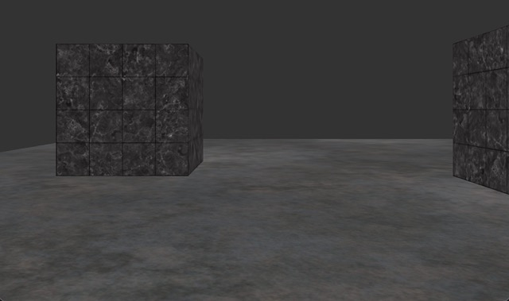

## Depth test function

`glDepthMask(GL_FALSE);`  perform 深度测试但是不更新  depth buffer

`glDepthFunc(GL_LESS);` 默认`GL_LESS`，作为更新 depth buffer 的条件，如果设置为`GL_ALWAYS`每次都会覆盖depth buffer：

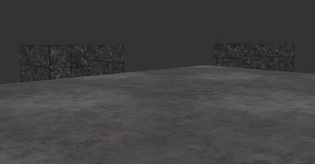

## Visualizing the depth buffer

可以通过 GLSL 的 built-in 变量 gl_FragCoord 将深度可视化：


> 涉及到z的精度问题，透视投影将z轴的变化变成了非线性的，变换后的深度正比于1/z ，所以导致近平面处depth精度很大，远处精度很小 （联想到当时games101提出的关于透视投影后，原frustum中点是更靠近近平面还是远平面的问题，答案是远平面。物理上有两种理解方式，一种是说经过“挤压”后，靠近远平面的部分密度更大，所以原来的等距点越靠近远平面就更密集；另一种简单的理解方式是看一条无限长的铁轨，远平面可以认为是无穷，中点无穷的一半，实际上也在透视的那个交点上，自然是更靠近远平面）

将深度可视化之后若想让灰度随深度线性变化，需要通过一系列变换得到线性的深度

```c++
float ndc = depth * 2.0 - 1.0; // [0,1]映射到[-1,1]
float linearDepth = (2.0 * near * far) / (far + near - ndc * (far - near));	 // 用透视矩阵算出投影前后z的关系，表示出原来的z，就是linearDepth

```

 

## Z-fighting

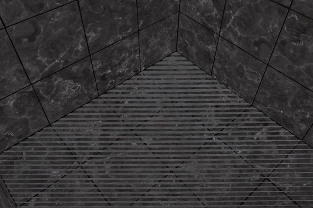

进入到箱子内部，可以看到本应重合的箱子底面和 plane 随着视角移动疯狂闪烁，由于浮点数精度不足出现了 z-fighting。

1. 物体之间尽量不要太近（不太现实
2. 将近平面设置的尽可能远，因为越靠近近平面精度越高，但是太远会导致裁剪，需要根据实际调整
3. 大多数深度缓冲区的精度为24bit，现在大多GPU也都支持32位的depth buffer，牺牲性能换取更高的精度有助于避免 z-fighting

# Stencil Test

stencil buffer 中通常存储 8bit 的数据，可以用于剔除或保留具有某一 stencil 值的 fragments

stencil buffer 的使用与 depth buffer 类似，通过`glEnable(GL_STENCIL_TEST); ` 开启 Stencil Test，同时每帧需要额外 `glClear(GL_STENCIL_BUFFER_BIT); `另外可以通过 `glStencilMask(0xFF);` 或者`glStencilMask(0x00);`来定义写入stencil buffer 的 bit-mask 

```cpp
glEnable(GL_STENCIL_TEST);
glClear(GL_COLOR_BUFFER_BIT | GL_DEPTH_BUFFER_BIT | GL_STENCIL_BUFFER_BIT);
glStencilFunc(GL_NOTEQUAL, 1, 0xFF); // stencil value 和 ref 都 masked 之后再比较
glStencilMask(0xFF); // 写入 stencil buffer 时经过的 mask
```

## Stencil Fucntion

共有两个函数可以配置 stencil testing

* `glStencilFunc(GLenum func, GLint ref, GLuint mask)`

  ref表示stencil test 与ref比较

* `glStencilOp(GLenum sfail, GLenum dpfail, GLenum dppass)` 

  * sfail 表示 stencil test fail 了应该怎么办
  * dpfail 是 stencil test 通过但是 depth test 没通过的情况
  * dppass表示都通过的情况

  默认参数为` (GL_KEEP, GL_KEEP, GL_KEEP)`

## Object outlining

可以使用 stencil test 勾勒出物体的轮廓，步骤如下：

1. `glENABLE(GL_STENCIL_TEST)` 启用 STENCIL_TEST
2. 渲染物体之前先把 stencil buffer 用1填满 (GL_ALWAYS)
3. 渲染场景
4. 关闭 stencil test 和 depth test
5. 将要加轮廓的物体scale放大一点点后，用轮廓的颜色重新渲染(只渲染stencil buffer不为1的地方)
6. 将 depth test和stencil test 的状态还原，以免影响后续物体的渲染

下面给 Depth Test 场景中的两个箱子加上轮廓：

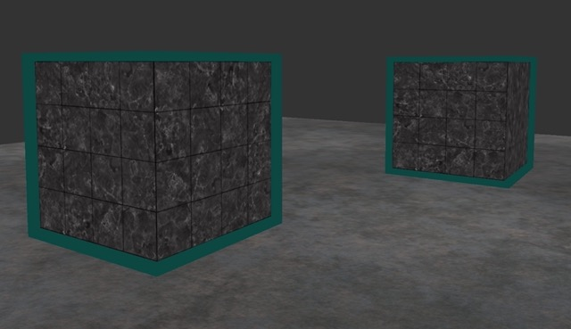

多个物体边缘重叠：

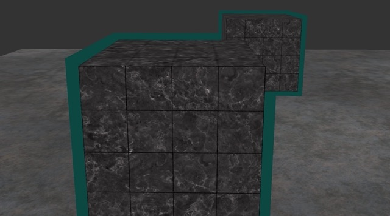

为了视觉美观可以将边缘加一个高斯模糊。

# Blending

`glTexImage2D(GL_TEXTURE_2D, 0, format, width, height, 0, format, GL_UNSIGNED_BYTE, data);`的format 设为RGBA 可以读带 alpha 通道的图，但是 opengl 默认不处理 alpha 值，像之前那样渲染会得到：

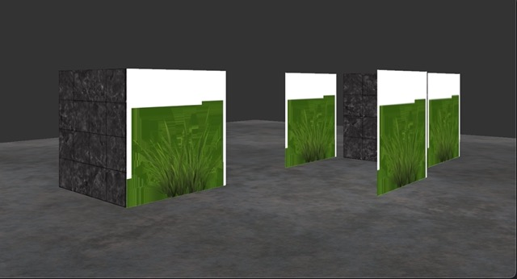

## Discarding Fragments

一般在 fragment shader 里可以将 alpha 小的部分 discard 掉

```cpp
vec4 texColor = texture(texture1, TexCoords);
if(texColor.a < 0.1)
    discard;
FragColor = texColor;
```

现在得到：

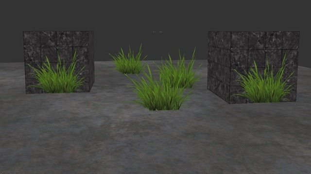

> bind 带 alpha 的 texture 一般不用默认的 warp mode，因为 GL_REPEAT 会使上下、左右底边插值，可以在 glBindTexture 之后将 warp mode 改成 GL_CLAMP_TO_EDGE
> `glTexParameteri( GL_TEXTURE_2D, GL_TEXTURE_WRAP_S, GL_CLAMP_TO_EDGE); `
> `glTexParameteri( GL_TEXTURE_2D, GL_TEXTURE_WRAP_T, GL_CLAMP_TO_EDGE);`

## Blending

discard 掉一些 fragment 也没有给我们渲染版透明物体的能力，可以用下面的语句开启：

```
glEnable(GL_BLEND);  
```

fragment shader 运行且各种 test 都通过之后，其输出和 framebuffer 中的颜色进行混合，可以通过 ` glBlendFunc(GLenum sfactor, GLenum dfactor)` 调整 src factor 和 dest factor，`glBlendEquation(GLenum mode)` 还可以指定 Src 和 Dst 的加减等关系

## Semi-transparent Textures

开启 blending，应用到半透明的纹理上，效果如下

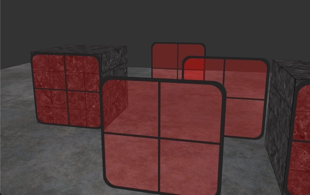

仔细观察，发现透明物体之间遮挡关系不对，原来是深度测试出了问题，深度测试时并不会关心 fragment 是否透明，为了解决这个问题，我们需要更改渲染顺序

1. 先渲染不透明物体
2. 根据透明物体的深度进行排序
3. 透明物体从远到近渲染

使用 std::map 创建物体到相机距离 distance 和其对应 model 变换的映射，根据 distance 排序：

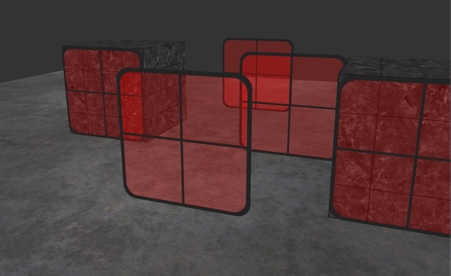

# Face Culling

## Winding Order & Face Culling

 OpenGL's GL_CULL_FACE option:

```
gl_Enable(GL_CULL_FACE);
glCullFace(GL_FRONT);  
glFrontFace(GL_CCW); // counter-clockwise
```

需要注意 OpenGL 默认 CCW winding，Direct3D 默认 CW winding。

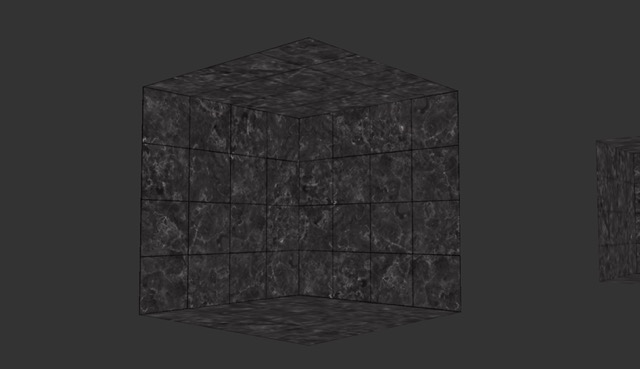

# Framebuffers

## Create Framebuffers

创建 & 绑定 FBO in opengl

```cpp
unsigned int fbo;
glGenFramebuffers(1, &fbo);
glBindFramebuffer(GL_FRAMEBUFFER, fbo);
```

这样创建好的 Framebuffer 还不能用，要 attach 到 color, depth 或 stencil buffer 中的一种才可以。而且每个 buffer 都要有相同的 sample 数量

```cpp
glBindFramebuffer(GL_FRAMEBUFFER, 0);   // 希望render输出到屏幕需要绑定到0(默认framebuffer)
```

在上述操作中我们往 fbo 绘制的数据并没有出现在屏幕上，所以叫做 off-screen 渲染，framebuffer 对应的 attachment 实际上就是一块可以存储 framebuffer 数据的内存，可以选择两种 attachment : texture 或者 renderbuffer objects

## Texture attachments

将 framebuffer attach 到 texture 上，前面的过程与加载 texture 类似，只不过 data 变成了 NULL，而且尺寸与屏幕大小相同

```cpp
unsigned int texture;
glGenTexture(1, &texture);
glBindTexture(GL_TEXTURE_2D, texture);

glTexImage2D(GL_TEXTURE_2D, 0, GL_RGB, 800, 600, 0, GL_RGB, GL_UNSIGNED_BYTE, NULL);

glTexParameteri(GL_TEXTURE_2D, GL_TEXTURE_MIN_FILTER, GL_LINEAR);
glTexParameteri(GL_TEXTURE_2D, GL_TEXTURE_MAG_FILTER, GL_LINEAR);  
```

attach 操作 ：

```cpp
glFramebufferTexture2D(GL_FRAMEBUFFER, GL_COLOR_ATTACHMENT0, GL_TEXTURE_2D, texture, 0);
```

参数从前到后解释，`GL_FRAMEBUFFER` 表示 target 的 framebuffer type (read/write) ，`GL_COLOR_ATTACHMENT0` 表示 attachment type  (可以一对多)，`GL_TEXTURE_2D` 表示想要 attach 的 texture 的类型，`texture`是实际的 texture 变量，`0`是 mipmap 的 level。

后面还可以给这个 framebuffer attach depth 或者 stencil texture，一般会分给 depth(24bit） 和 stencil(8bit) 放到一起，使用`GL_DEPTH_STENCIL_ATTACHMENT`

## Renderbuffer object attachments

另一种方式是使用 rbo，使用  rbo  会把所有的 render data 直接存入 buffer中，不会把数据转换成 texture 的格式；但是不能直接从 rbo 中读值，需要通过` glReadPixels`一次取一小片区域的数据。综上 opengl 可以对其采取特殊的存储优化。正是因为 rbo 不能直接读，所以更适合存储 depth 和 stencil 数据，因为一般不需要对这两个值采样，只需要进行深度&模板测试

rbo 的具体使用方法也是类似：

```cpp
// create rbo & bind to framebuffer
unsigned int rbo;
glGenRenderbuffers(1, &rbo);
glBindRenderbuffer(GL_RENDERBUFFER, rbo);  
// specify the rbo as a depth24_stencil8 rbo
glRenderbufferStorage(GL_RENDERBUFFER, GL_DEPTH24_STENCIL8, 800, 600);
glFramebufferRenderbuffer(GL_FRAMEBUFFER, GL_DEPTH_STENCIL_ATTACHMENT, GL_RENDERBUFFER, rbo);  
```

## Rendering to a texture

采用 framebuffer + rbo 的方式，往 texture 里面渲染需要下面三步：

1. `glBindTexture(GL_TEXTURE_2D, framebuffer);`
2. Bind to the default framebuffer.
3. Draw a quad that spans the entire screen with the new framebuffer's color buffer as its texture.

此时 Framebuffer 中的图像：

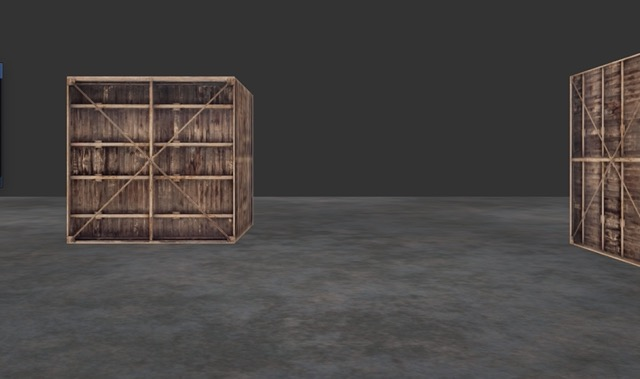

屏幕上的图像 (开启`glPolygonMode(GL_FRONT_AND_BACK, GL_LINE)`)，实际是将 framebuffer 上的图像作为texture 绘制到屏幕上的矩形 

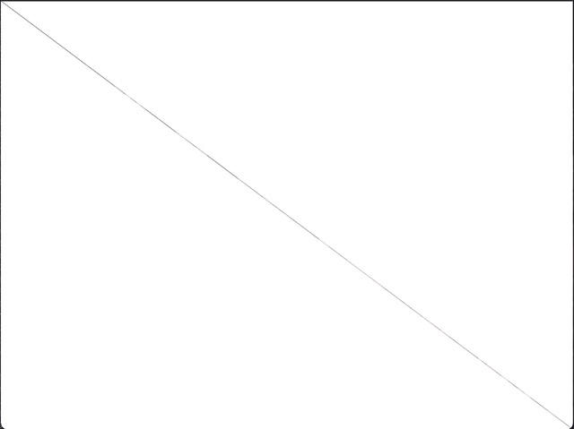

## Post-processing

以 framebuffer 做纹理可以对原图像在 shader 中进行一些操作，这就是后处理，比如：

```cpp
    FragColor = vec4(vec3(1.0 - texture(screen_texture, TexCoords)), 1.0);
```

只需改一行就能得到反相的输出

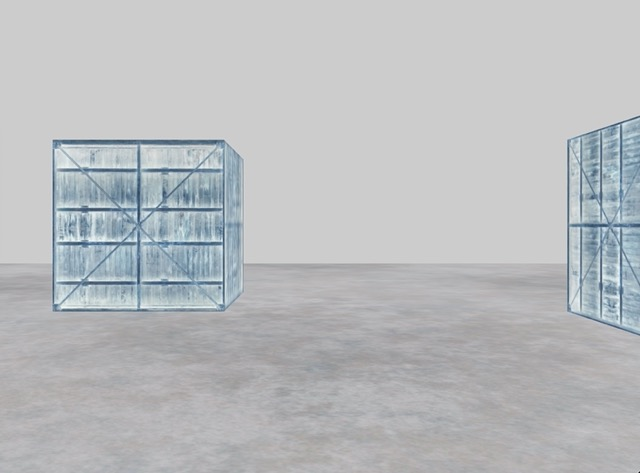

或者其他滤波或者风格化的图像

# Cubemaps

cubemap 其实就是 6 张面纹理拼起来的一个 box，通过光线方向与 box 交点来采样

```cpp
unsigned int loadCubemap(vector<string> faces) {
    unsigned int textureID;
    glGenTextures(1, &textureID);
    glBindTexture(GL_TEXTURE_CUBE_MAP, textureID);
    
    for(unsigned int i=0; i<faces.size(); i++) {
        int w, h, nrComponents;
        unsigned char *data = stbi_load(faces[i].c_str(), &w, &h, &nrComponents, 0);
        if (data) {
            glTexImage2D(GL_TEXTURE_CUBE_MAP_POSITIVE_X + i,
                         0, GL_RGB, w, h, 0, GL_RGB, GL_UNSIGNED_BYTE, data);
            stbi_image_free(data);
        }
    }
}
```

注意 `glBindTexture(GL_TEXTURE_CUBE_MAP, textureID);` 参数对应`GL_TEXTURE_CUBE_MAP`，里面的六张面纹理是有顺序的，通过`GL_TEXTURE_CUBE_MAP_POSITIVE_X + i` 加载到相应的位置。

因为我们希望这个 cubemap 永远包在 camera 的最外层，我们先渲染cubemap(这时不写入 depth buffer)，然后在渲染物体：

```cpp
    glDepthMask(GL_FALSE); // 不写入 depth buffer
    skybox_shader.use();
    // ... set view and projection matrix
    glBindVertexArray(cubemapVAO);
    glBindTexture(GL_TEXTURE_CUBE_MAP, cubemap_texture);
    glDrawArrays(GL_TRIANGLES, 0, 36);
    glDepthMask(GL_TRUE);
	// draw rest scene
```

我们希望无论相机怎么运动，都相当于在这个 cubemap 的中心转动，所以这里`view = glm::mat4(glm::mat3(camera.GetViewMatrix()));`可以去掉 translate ，只取旋转

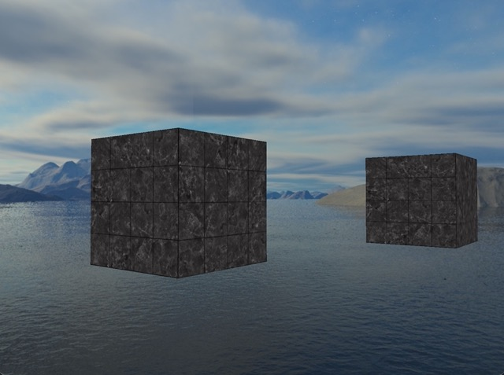

## Optimization

上面的过程是先渲染了cubemap，然后渲染物体再进行覆盖，这里有个性能上的优化点：如果先渲染物体，被物体挡住的cubemap部分其实可以直接通过 深度测试 discard 掉，我们可以在shader 中将 cubemap 的深度值改成最远(z=1.0)，但是由于`glclear`会将 depth buffer 初始化为 1，所以深度测试的策略需改成 `glDepthFunc(GL_LEQUAL)`（默认是`GL_LESS`）

```cpp
/* cpp */    
	glDepthFunc(GL_LEQUAL);
    skybox_shader.use();
    // ... draw cubemap
    glDepthFunc(GL_LESS);

/* vertex shader */
	TexCoords = aPos;
    vec4 pos = projection * view * vec4(aPos, 1.0);
    gl_Position = pos.xyww;

```

## Environment Mapping

通过 shader 实现与 cubemap 的交互，镜面反射：

```cpp
// Reflection
vec3 view = normalize(cameraPos - Position);
vec3 R = reflect(-view, normalize(Normal));
FragColor = vec4(texture(skybox, R).rgb, 1.0);
```

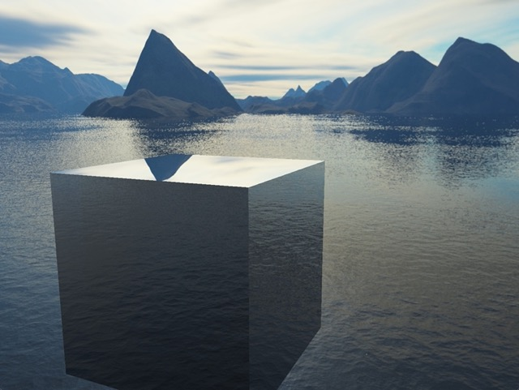

折射：

```cpp
// Refraction
float ratio = 1.00 / 1.52;
vec3 I = normalize(Position - cameraPos);
vec3 R = refract(I, normalize(Normal), ratio);
FragColor = vec4(texture(skybox, R).rgb, 1.0);
```

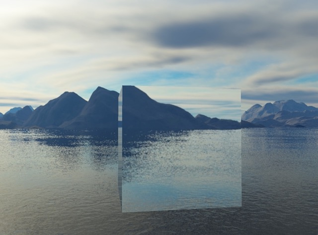

## Dynamic environment maps

上面的 shader 实现只能做 cubemap 的反射，无法反射环境中其他物体，为了解决这个问题，最简单的办法是在反射处采用 framebuffer 存好6个方向的图，生成一个动态的 cubemap，然后根据这个动态的 cubemap 计算反射。带来最大的问题是每生成一个这样的动态cubemap，等于做了六次渲染，所以实际情况中应该尽可能使用 skybox，或者多用一些 hack，尽量避免直接生成这种动态cubemap。

# Advanced Data

之前的学习中我们大量使用了 buffer，我们用`glBindBuffer(GL_ARRAY_BUFFER, buffer);`为`glBufferData()`指定target为`GL_ARRAY_BUFFER`，用来处理顶点数据。

通过调用`glBufferData()`往buffer里面填数据`glBufferSubData()`可以往buffer中的某段注入数据，比如:

```cpp
glBindBuffer(GL_ARRAY_BUFFER, cubeVBO);
glBufferData(GL_ARRAY_BUFFER, sizeof(cubeVertices), cubeVertices, GL_STATIC_DRAW);
glBufferSubData(GL_ARRAY_BUFFER, 24, sizeof(data), &data); // Range: [24, 24 + sizeof(data)]
```

可以通过`glMapBuffer`取得target buffer的指针，然后 `memset`，注意用完需要 `glUnmapBuffer()`

```cpp
float data[] = {
  0.5f, 1.0f, -0.35f
  [...]
};
glBindBuffer(GL_ARRAY_BUFFER, buffer);
// get pointer
void *ptr = glMapBuffer(GL_ARRAY_BUFFER, GL_WRITE_ONLY);
// now copy data into memory
memcpy(ptr, data, sizeof(data));
// make sure to tell OpenGL we're done with the pointer
glUnmapBuffer(GL_ARRAY_BUFFER);
```

## Batching vertex attributes

通过`glVertexAttribPointer()`我们可以自定义 vertex array buffer 中各 attribute 的 layout

```cpp
glEnableVertexAttribArray(0);
glVertexAttribPointer(0, 3, GL_FLOAT, GL_FALSE, 8 * sizeof(GL_FLOAT), (void*)0);
glEnableVertexAttribArray(1);
glVertexAttribPointer(1, 3, GL_FLOAT, GL_FALSE, 8 * sizeof(GL_FLOAT), (void*)(3*sizeof(float)));
glEnableVertexAttribArray(2);
glVertexAttribPointer(2, 2, GL_FLOAT, GL_FALSE, 8 * sizeof(GL_FLOAT), (void*)(6*sizeof(float))););
// ...
```

比如可以按 `pos, normal, texCoord` 交叉存储，简写为 1 2 3 1 2 3 1 2 3 ... 也可以做这么一件事，采用批处理 batch 成大块的 chunck，即变成 1 1 1 1 ... 2 2 2 2 ... 3 3 3 3 ...，可以通过 `glBufferSubData()`分别将pos, normal, texCoord 传进去

```cpp
float positions[] = { ... };
float normals[] = { ... };
float tex[] = { ... };
// fill buffer
glBufferSubData(GL_ARRAY_BUFFER, 0, sizeof(positions), &positions);
glBufferSubData(GL_ARRAY_BUFFER, sizeof(positions), sizeof(normals), &normals);
glBufferSubData(GL_ARRAY_BUFFER, sizeof(positions) + sizeof(normals), sizeof(tex), &tex);
```

还得 update  attribute 的 layout :

```cpp
glVertexAttribPointer(0, 3, GL_FLOAT, GL_FALSE, 3 * sizeof(GL_FLOAT), (void*)0;
glVertexAttribPointer(0, 3, GL_FLOAT, GL_FALSE, 3 * sizeof(GL_FLOAT), (void*)(sizeof(pos)));
glVertexAttribPointer(1, 3, GL_FLOAT, GL_FALSE, 2 * sizeof(GL_FLOAT), (void*)(sizeof(pos + normal)));
```

## Copying buffers

`glCopyBufferSubData()`可以在 buffer 之间进行数据的 copy 操作

```cpp
float vertexData[] = { ... };
glBindBuffer(GL_ARRAY_BUFFER, vbo1);
glBindBuffer(GL_COPY_WRITE_BUFFER, vbo2);
glCopyBufferSubData(GL_ARRAY_BUFFER, GL_COPY_WRITE_BUFFER, 0, 0, 8 * sizeof(float));  
```

# Advanced GLSL

## GLSL's built-in variables

最常用的 built-in 变量是 `gl_Position` 和 `gl_FragCoord`

### Vertex Shader

`gl_Position `其实是 vertex shader 在裁剪空间的输出

`gl_PointSize`是比用点作为primitive，如`glDrawArrays(GL_POINTS, 0, 36)`绘制时，指定 point primitive 的大小

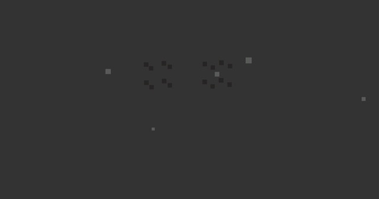

`gl_VertexID`只读变量，保存当前正在处理的 vertexID，当应用 indexed rendering，比如`glDrawElement`的时候

### Fragment Shader

`gl_FragCoord`，其实 depth test 就是比较的`gl_FragCoord.z`，其xy值的原点在屏幕左下角，这点要注意，通过判断 gl_FragCoord 的坐标可以将一块 fragment 按照不同策略渲染

```cpp
if(gl_FragCoord.x<400) {
    FragColor = vec4(1, 0, 0, 1);
}
else {
    FragColor = texture(texture1, TexCoords);
}
```

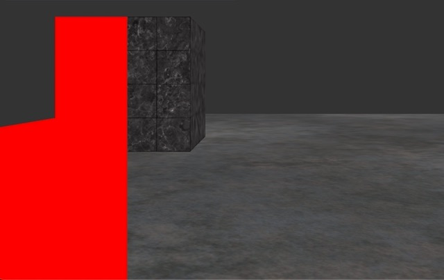

`gl_FrontFacing` : face_culling 的时候说到Opengl 会根据三角形是顺时针还是逆时针 winding 的来决定正面还是背面，`gl_FrontFacing`就表示当前 fragment 所在 primitive 是正面还是反面

`gl_FragDepth` : `gl_FragCoord`中的值都是只读的，可以通过`gl_FragDepth`手动修改其z值，其中有个细节：如果往`gl_FragDepth`里面写值，OpenGL就会自动关闭 early depth test，会影响性能，因为多做了很多会被深度测试丢掉的渲染

## Interface Blocks

介绍了在 vertex shader 和 fragment shader 中传数据可以用 struct 更易于管理

## Uniform Buffer Objects

OpenGL中可以声明 uniform 变量，可供全部的 shader 使用，相当于存在GPU上的全局变量

```cpp
layout (std140) uniform ExampleBlock // 按照std(140)的layout声明uniform block
{
    float value;
    vec3  vector;
    mat4  matrix;
    float values[3];
    bool  boolean;
    int   integer;
};  
```

默认GLSL使用统一的内存布局(shared layout，硬件分配)，这样可以使用`glGetUniformIndices`来得到各个成员的 offset；虽然 shared layout 更节省空间，但是急需要取成员的index，效率比较低，一般会采用 std140 的 layout 规则，类似于cpp中的内存对齐规则。

## Using Uniform Buffer

```cpp
unsigned int uboExampleBlock;
glGenBuffers(1, &uboExampleBlock);
glBindBuffer(GL_UNIFORM_BUFFER, uboExampleBlock);
glBufferData(GL_UNIFORM_BUFFER, 152, NULL, GL_STATIC_DRAW); // allocate 152 bytes of memory
glBindBuffer(GL_UNIFORM_BUFFER, 0);
```

用`glBufferSubData`更新 uniform buffer 的值，相应的 shader 都会实用更新后的值，下面是 shader 中的 uniform block 如何与OpenGL中的 uniform block object 对应关系：

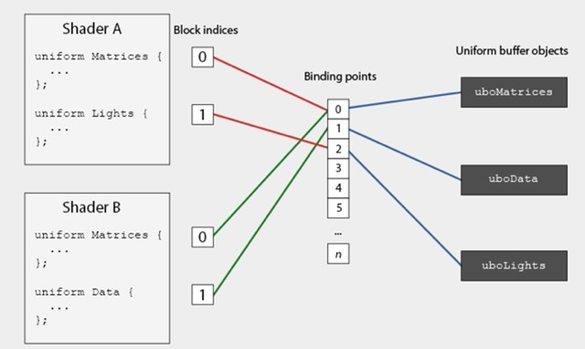

可以通过 Opengl Context 的 Binding points 指定 uniform buffer 绑定到什么位置，然后通过：

```cpp
unsigned int lights_index = glGetUniformBlockIndex(shaderA.ID, "Lights");   
glUniformBlockBinding(shaderA.ID, lights_index, 2);
```

将 shader 中的 uniform block 和 binding point 2 绑定起来。

```cpp
glBindBufferBase(GL_UNIFORM_BUFFER, 2, uboExampleBlock); 
// or
glBindBufferRange(GL_UNIFORM_BUFFER, 2, uboExampleBlock, 0, 152);
```

要修改 uniform buffer 中的数据：

```cpp
glBindBuffer(GL_UNIFORM_BUFFER, uboExampleBlock);
int b = true; // bools in GLSL are represented as 4 bytes, so we store it in an integer
glBufferSubData(GL_UNIFORM_BUFFER, 144, 4, &b); 
glBindBuffer(GL_UNIFORM_BUFFER, 0);
```

## A Simple Example

.vs

```cpp
#version 330 core
layout (location = 0) in vec3 aPos;
layout (std140) uniform Matrices {
    mat4 projection;
    mat4 view;
};
uniform mat4 model;

void main() {
    gl_Position = projection * view * model * vec4(aPos, 1.0);
}  

```

cpp

```cpp
unsigned int uniform_block_red_index = glGetUniformBlockIndex(shader_red.ID, "Matrices");
glUniformBlockBinding(shader_red.ID, uniform_block_red_index, 0);
// bind other sahders to ubo_idx0

// create ubo and bind to GL_UNIFORM_BUFFER
unsigned int ubo_matrices;
glGenBuffers(1, &ubo_matrices);
glBindBuffer(GL_UNIFORM_BUFFER, ubo_matrices);
glBufferData(GL_UNIFORM_BUFFER, 2 * sizeof(glm::mat4), NULL, GL_STATIC_DRAW);
glBindBuffer(GL_UNIFORM_BUFFER, 0);
glBindBufferRange(GL_UNIFORM_BUFFER, 0, ubo_matrices, 0, 2 * sizeof(glm::mat4));

// set uniform block
glm::mat4 view = camera.GetViewMatrix();
glBindBuffer(GL_UNIFORM_BUFFER, ubo_matrices);
glBufferSubData(GL_UNIFORM_BUFFER, sizeof(glm::mat4), sizeof(glm::mat4), glm::value_ptr(view));
glBindBuffer(GL_UNIFORM_BUFFER, 0);

//render
glBindVertexArray(cubeVAO);
shaderRed.use();
model = glm::mat4(1.0f);
model = glm::translate(model, glm::vec3(-0.75f, 0.75f, 0.0f));
shaderRed.setMat4("model", model);
glDrawArrays(GL_TRIANGLES, 0, 36);        
// ... draw ohter cubes 
```


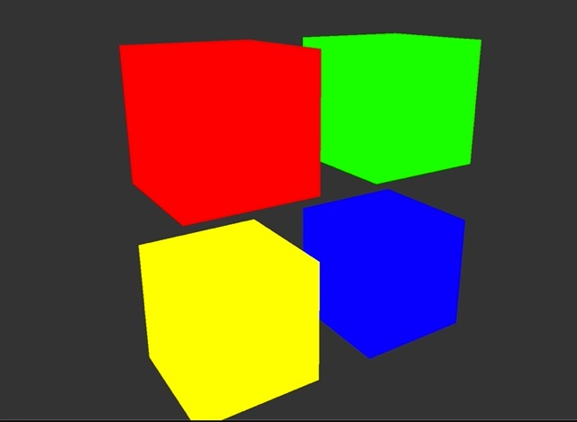

# Geometry Shader

geometry shader 是 vertex shader 和 fragment shader 中一个可选的步骤，可以将输入的图元转化为不同的图元，甚至还可以增加顶点数量

```cpp
#version 330 core
layout (points) in;
layout (line_strip, max_vertices=2) out;

void main() {
    gl_Position = gl_in[0].position + vec4(0.1 ,0, 0, 0);
    EmitVertex();
    gl_Position = gl_in[0].position + vec4(-0.1 ,0, 0, 0);
    EmitVertex();
    
    EndPrimitive();
}
```

要应用 geometry shader，需要 compile & link 到程序：

```cpp
geometryShader = glCreateShader(GL_GEOMETRY_SHADER);
glShaderSource(geometryShader, 1, &gShaderCode, NULL);
glCompileShader(geometryShader);  
[...]
glAttachShader(program, geometryShader);
glLinkProgram(program);  
```

我们之前copy的`shader.h`已经帮我们做好了，直接加上 geometry shader 得到：

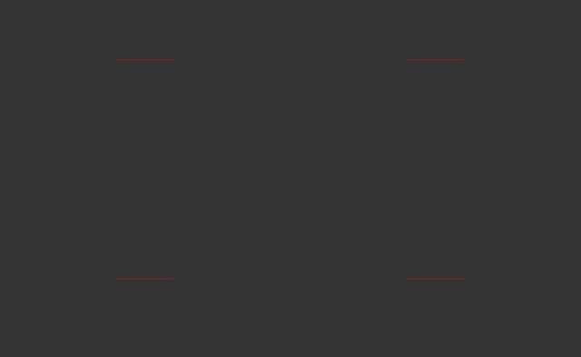

很 Boring 的一张图 ，下面做点有意义的事情。

我们让 geometry shader 输出一些 triangle_strip，这种形状只需 N+2 个顶点便可得到 N 个三角形，是很高效的。注意 vertex shader 的输出也要和 geometry shader 的输入对应起来。

```cpp
// vs
    out VS_OUT {
        vec3 color;
    } vs_out;
// gs
    in VS_OUT {
        vec3 color;
    } gs_in[];  // geometry shader 是对一组顶点进行处理，所以输入要以数组的形式定义
```

在输入的四个点，每个点分成五个顶点，创建一个3个三角形的strip：

```cpp
// .gs
fColor = gs_in[0].color;
gl_Position = position + vec4(-0.2, -0.2, 0.0, 0.0);    // 1:bottom-left
EmitVertex();
gl_Position = position + vec4( 0.2, -0.2, 0.0, 0.0);    // 2:bottom-right
EmitVertex();
gl_Position = position + vec4(-0.2,  0.2, 0.0, 0.0);    // 3:top-left
EmitVertex();
gl_Position = position + vec4( 0.2,  0.2, 0.0, 0.0);    // 4:top-right
EmitVertex();
gl_Position = position + vec4( 0.0,  0.4, 0.0, 0.0);    // 5:top
fColor = vec3(1.0, 1.0, 1.0); // top的点是白色，图元内部会进行插值
EmitVertex();
EndPrimitive();
```

得到的结果：

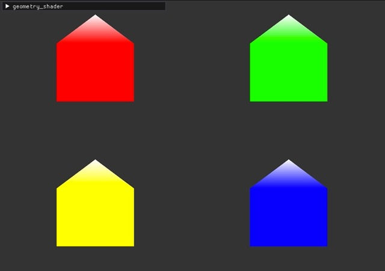

## Exploding Objects

通过 geometry shader 对每个三角形沿着法线做一个位移f(t)可以得到最简单的爆炸效果：

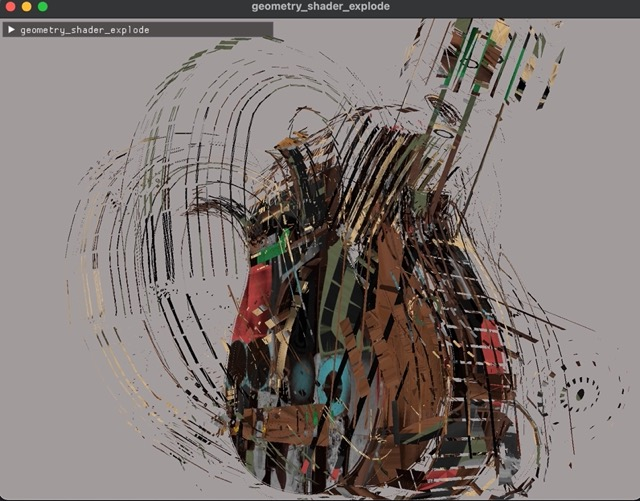

## Displaying Normals

再用 geometry shader 画出每个定点的法线：

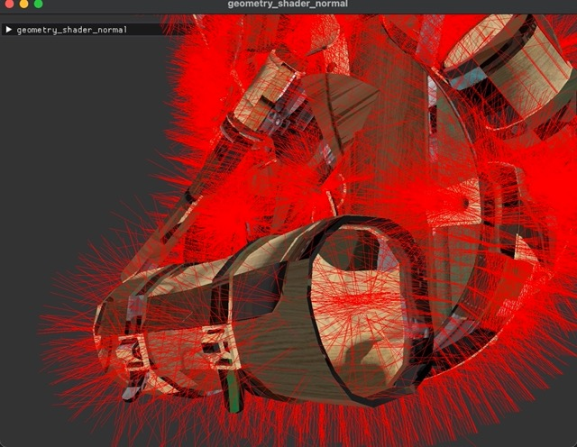

顺便找到一个shader中实现随机数的算法：

```cpp
// 根据uv坐标生成随机数
float rand(vec2 co){
  return fract(sin(dot(co.xy ,vec2(12.9898,78.233))) * 43758.5453);
}
```

# Insctancing

在画一些模型相同的物体时，可以共用一套顶点，前面我们都是这样写的：

```cpp
for(int i=0; i<ModelCounts; i++) {
    DoSomeOperations(); // bindVAO, texture, set uniforms
    glDrawArrays(GL_TRIANGLES, 0, amount_of_vertices);
}
```

这样做其实是对GPU不友好的，因为每一次 drawcall (比如glDrawArrays 或者 glDrawElements) 都会吃掉一些性能，因为在真正画顶点数据之前 OpenGL 需要通过 CPU 与 GPU 通讯，把从哪个 buffer 读数据、顶点属性都有什么之类的信息通过 GPU 总线传递给 GPU。所以需要想个办法，一次 drawcall 把这些物体一次性画出来。

`glDrawArrays` 和 `glDrawElements` 分别用 `glDrawArraysInstanced` 和 `glDrawElementsInstanced` 替代，然后结合 GLSL 在vertex shader中的 built-in 变量 `gl_InstanceID`，每调用一次这个绘制instance的函数，`gl_InstanceID` 就会增1，然后就可以索引每个 instance 的属性了

```cpp
// .vs
#version 330 core
layout (location = 0) in vec2 aPos;
layout (location = 1) in vec3 aColor;

out vec3 fColor;
uniform vec2 offsets[100];

void main() {
    vec2 offset = offsets[gl_InstanceID];
    gl_Position = vec4(aPos + offset, 0.0, 1.0);
    fColor = aColor;
}  

// .cpp
for(unsigned int i = 0; i < 100; i++) {
    shader.setVec2(("offsets[" + std::to_string(i) + "]")), translations[i]);
}  
```

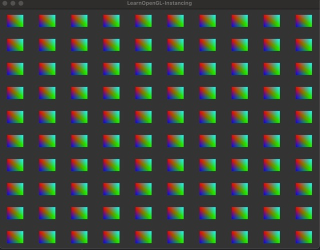

## Instanced arrays

上个例子中是 100 个 instance，但是当实例数量远超过 100 的时候，可能 hit 到可以传输给 shader 的 uniform变量数量的 limit，这时可以用 instanced array。将 instance array 作为 vertex attribute 存储

```cpp
glEnableVertexAttribArray(2);
glBindBuffer(GL_ARRAY_BUFFER, instanceVBO); // this attribute is from another buffer
glVertexAttribPointer(2, 2, GL_FLOAT, GL_FALSE, 2 * sizeof(float), (void*)0);
glBindBuffer(GL_ARRAY_BUFFER, 0);	
glVertexAttribDivisor(2, 1);  // 请求的顶点属性，attribute divisor
```

像别的顶点属性一样，我们把 translations 当做顶点数据存储到 instanceVBO 中，不同的是`glVertexAttribDivisor(2, 1)`函数设置id=2的顶点属性的 attribute divisor 为1 (默认是0表示在渲染每个顶点的时候更新，1表示在渲染每个instance的时候更新)

```cpp
//.vs 
vec2 pos = aPos * gl_InstanceID / 100.0; // 渐变缩小
```


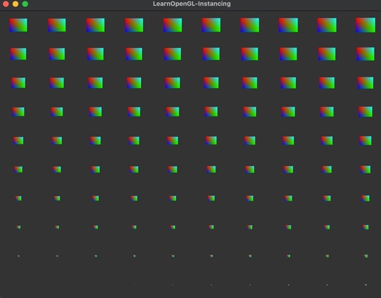

## Creating a Planet

我在我们创建一个行星的场景，由一个星球模型加上一个石头模型的很多 instance 来构建这个场景，先采用把每个 rock 调用一次 drawcall 的方法：

```cpp
// draw planet
shader.use();
shader.setMat4("model", model);
planet.Draw(shader);
// draw meteorites
for(unsigned int i = 0; i < amount; i++) {
    shader.setMat4("model", modelMatrices[i]); // 利用rannd()创建沿一个半径随机分布的星带
    rock.Draw(shader);
}  
```

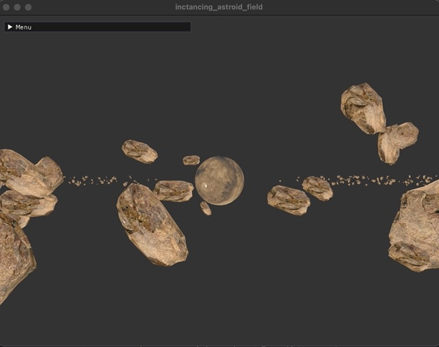

当rock的数量增加到3000-5000时，明显感觉帧数下降，实测5000时只有25fps，下面用 instancing 的做法：

```cpp
//.vs
#version 330 core
layout (location = 0) in vec3 aPos;
layout (location = 2) in vec2 aTexCoords;
layout (location = 3) in mat4 instanceMatrix;

out vec2 TexCoords;

uniform mat4 projection;
uniform mat4 view;

void main()
{
    gl_Position = projection * view * instanceMatrix * vec4(aPos, 1.0); 
    TexCoords = aTexCoords;
}
```

我们把 instance 的模型变换矩阵当成 vertex attribute 传入 shader，但shader中的顶点属性最大是vec4类型的，而变换矩阵可以看做4个vec4，所以需要分4个 atteibute 传：

```cpp
glGenBuffers(1, &buffer);
glBindBuffer(GL_ARRAY_BUFFER, buffer);
glBufferData(GL_ARRAY_BUFFER, amount * sizeof(glm::mat4), &modelMatrices[0], GL_STATIC_DRAW);
  
for(unsigned int i = 0; i < rock.meshes.size(); i++) {
    unsigned int VAO = rock.meshes[i].VAO;
    glBindVertexArray(VAO);
    // vertex attributes
    std::size_t vec4Size = sizeof(glm::vec4);
    glEnableVertexAttribArray(3); 
    glVertexAttribPointer(3, 4, GL_FLOAT, GL_FALSE, 4 * vec4Size, (void*)0);
    glEnableVertexAttribArray(4); 
    glVertexAttribPointer(4, 4, GL_FLOAT, GL_FALSE, 4 * vec4Size, (void*)(1 * vec4Size));
    glEnableVertexAttribArray(5); 
    glVertexAttribPointer(5, 4, GL_FLOAT, GL_FALSE, 4 * vec4Size, (void*)(2 * vec4Size));
    glEnableVertexAttribArray(6); 
    glVertexAttribPointer(6, 4, GL_FLOAT, GL_FALSE, 4 * vec4Size, (void*)(3 * vec4Size));

    glVertexAttribDivisor(3, 1);
    glVertexAttribDivisor(4, 1);
    glVertexAttribDivisor(5, 1);
    glVertexAttribDivisor(6, 1);

    glBindVertexArray(0);
}  
```

这样即使有 20000 个rock，帧数也能达到接近50：

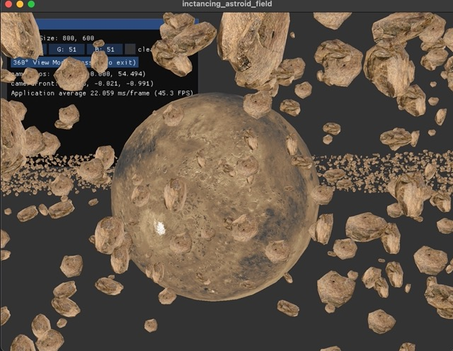


# Anti-Aliasing

图像放大观察到边缘呈锯齿状


## Multi-Sampling

简称 MSAA，不同于 SSAA 的地方在于不用每个 subsample 都运行 fragment shader。

4X MSAA 用 4 倍大小的 depth/stencil buffer 来进行 depth/stencil test 来计算 subsample 的覆盖率，framebuffer 其实也是 4 倍的大小，用来存储每个 subsample 对本像素颜色的贡献。但是重点在于每个像素里的每个 primitive 只会走一次 fragment shader.

## MSAA in OpenGL

OpenGL 里可以选择采样 multi-sample，这样在每个像素点处会采集4个 subsamples

```cpp
glfwWindowHint(GLFW_SAMPLES, 4);
glEnable(GL_MULTISAMPLE); 
```


## Off-screen MSAA

由于 GLFW 负责创建 multi-sample buffer，所以启用 MSAA很简单，但如果想在 framebuffer 中启用 multi-sample，需要自己手动创建 multisampled buffers。

回顾 framebuffer 那一节，有两种方法：texture attachments 和 renderbuffer attachments

* multisampled texture attachments  就是把 `GL_TEXTURE_2D` 变成 `GL_TEXTURE_2D_MULTISAMPLE`

  ```cpp
  glBindTexture(GL_TEXTURE_2D_MULTISAMPLE, tex);
  glTexImage2DMultisample(GL_TEXTURE_2D_MULTISAMPLE, samples, GL_RGB, width, height, GL_TRUE); // samples 是采样总数量，最后一个参数设置为true表示每个像素都用相同的子采样 pattern
  glBindTexture(GL_TEXTURE_2D_MULTISAMPLE, 0);  
  glFramebufferTexture2D(GL_FRAMEBUFFER, GL_COLOR_ATTACHMENT0, GL_TEXTURE_2D_MULTISAMPLE, tex, 0);
  ```

  现在绑定的 framebuffer 就是一个 multi-sampled color buuffer
  
* multisampled renderbuffer objects
  同样只需要将 `glRenderbufferStorage` 变成 `glRenderbufferStorageMultisample` 

  ```cpp
  glRenderbufferStorageMultisample(GL_RENDERBUFFER, 4, GL_DEPTH24_STENCIL8, width, height); 
  ```

下面介绍如何向 multiple-sampled framebuffer 输出渲染结果：

`glBlitFramebuffer` 可以在 framebuffer 之间进行数据 copy，同时 resolve 一个 multisampled framebuffer，

```cpp
glBindFramebuffer(GL_READ_FRAMEBUFFER, multisampledFBO);
glBindFramebuffer(GL_DRAW_FRAMEBUFFER, 0);
glBlitFramebuffer(0, 0, width, height, 0, 0, width, height, GL_COLOR_BUFFER_BIT, GL_NEAREST); 
```

上面的步骤将 multisampledFBO 传给了 default framebuffer (id=0)，这样也可以在屏幕上得到 MSAA 处理后的图像。

## Post-process with multi-sampling

我们得到的 multisampled-texture 不能直接在 fragment shader 中使用，需要通过 `glBlitFramebuffer`将 multisampled buffer 中数据传给 non-multisampled texture attachment 然后像正常 framebuffer 那样处理。

# Shadow Mapping

shadow map 的概念就是在光源处先进行一次渲染，得到 shadow map，存储每个 fragment 对应的深度信息，然后在相机处渲染时，与 shadow map 中的深度进行比较判断是否在阴影里，原理图：

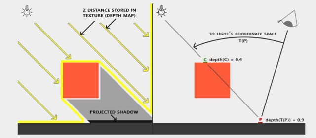

## Depth Map

第一趟 pass 要在光源的位置生成一张 depth map，可以用 frame buffer 保存：

```cpp
// generate depth map
unsigned int depthMapFBO;
glGenFramebuffers(1, &depthMapFBO); 

const unsigned int SHADOW_WIDTH = 1024, SHADOW_HEIGHT = 1024;
unsigned int depthMap;
glGenTextures(1, &depthMap);
glBindTexture(GL_TEXTURE_2D, depthMap);
glTexImage2D(GL_TEXTURE_2D, 0, GL_DEPTH_COMPONENT, 
             SHADOW_WIDTH, SHADOW_HEIGHT, 0, GL_DEPTH_COMPONENT, GL_FLOAT, NULL);
glTexParameteri(GL_TEXTURE_2D, GL_TEXTURE_MIN_FILTER, GL_NEAREST);
glTexParameteri(GL_TEXTURE_2D, GL_TEXTURE_MAG_FILTER, GL_NEAREST);
glTexParameteri(GL_TEXTURE_2D, GL_TEXTURE_WRAP_S, GL_REPEAT); 
glTexParameteri(GL_TEXTURE_2D, GL_TEXTURE_WRAP_T, GL_REPEAT);  

// attach to depth buffer
glBindFramebuffer(GL_FRAMEBUFFER, depthMapFBO);
glFramebufferTexture2D(GL_FRAMEBUFFER, GL_DEPTH_ATTACHMENT, GL_TEXTURE_2D, depthMap, 0);
glDrawBuffer(GL_NONE); //不需要写颜色
glReadBuffer(GL_NONE);
glBindFramebuffer(GL_FRAMEBUFFER, 0);  
```

第二趟 pass 要根据 shadow map 判断 fragment 是否在阴影中

```cpp
float shadow = ShadowCalculation(fs_in.FragPosLightSpace);
vec3 lighting = (ambient + (1.0 - shadow) * (diffuse + specular)) * color; 
```

scene:

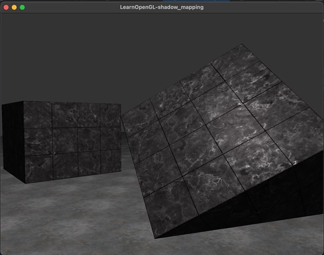

会形成 artifacts，一些周期性的条纹：

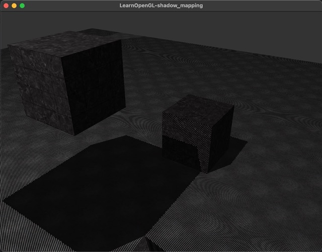

形成的原因 ：

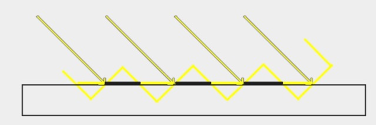

为了解决  shadow map 受 resolution 限制出现的 self-shadowing，通常采用加一个 bias 的方法，可以是常数，也可以与表面的角度相关：

```cpp
// constant bias 0.005
float shadow = currentDepth - 0.005 > closestDepth  ? 1.0 : 0.0;  
// bias change with surface angle
float bias = max(0.05 * (1.0 - dot(normal, lightDir)), 0.005);  
```

## Peter Panning

加了 bias 必然会导致物体根部与影子分离，这种情况叫做 peter panning:

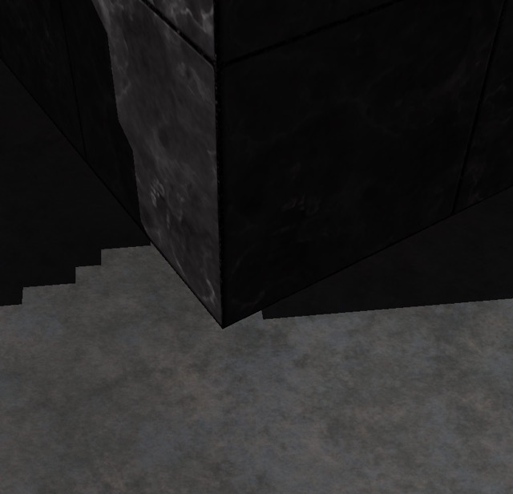

一种解决方案是在生成 depth map 时采用 front face culling：

```cpp
glCullFace(GL_FRONT);
RenderSceneToDepthMap();
glCullFace(GL_BACK); // don't forget to reset original culling face
```

## Over Sampling

在场景中转动视角可以发现远处有一块区域是在阴影中的：

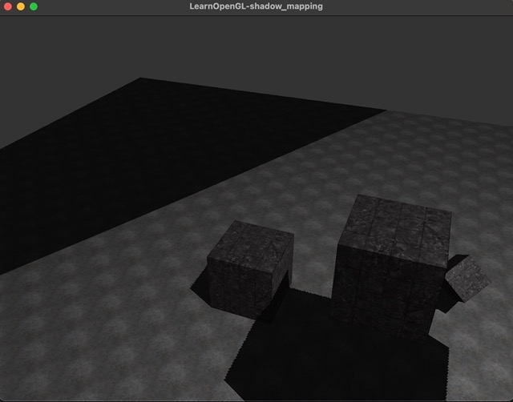

这是因为那块区域在我们在光源处的 ortho_projection 形成的 frustum 之外，深度记录值是>1的，所以用这个大于1的值与 view frustum 中的深度比较，肯定是略大的，就会判断在阴影中，要解决这个问题，需要在fragment shader 中将深度大于1的情况考虑到

```cpp
if(project_coords.z > 1.0) return 0;
```

## PCF

全程 Percentage-closer Filtering，一种生成 soft shadow 的方法。参考 RTR4

还是因为 depth map 精度不足的问题，生成的阴影会有比较大的锯齿，最直接的办法是提高 depth map 的精度，或者将光源放的尽可能靠近场景，但是通常很难通过这个方法提高阴影质量。

PCF 的简单实现：

```cpp
vec2 shadow_map_size = 1.0 / textureSize(shadow_map, 0);
for(int x=-1; x<=1; x++) {
    for(int y=-1; y<=1; y++) {
        float closest_depth = 
            texture(shadow_map, project_coords.xy + vec2(x,y) * shadow_map_size).r;
        shadow += current_depth-bias > closest_depth ? 1.0 : 0.0;
    }
}
return shadow / 9.0f;
```

效果：

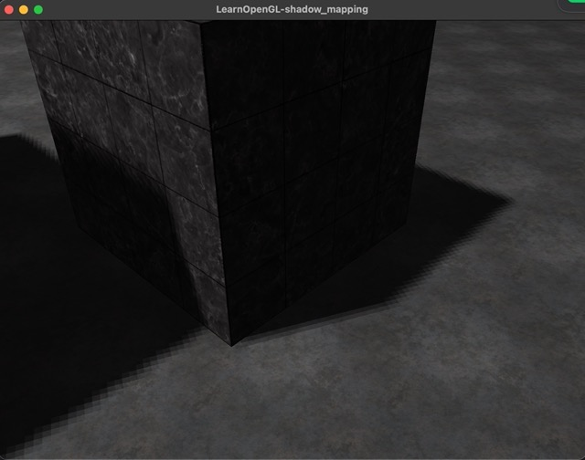

可以改用更大的 filter 来改善 pcf 的效果

## Orthographic vs. Perspective

在生成 depth map 的时候有两种投影方式，正交或者透视：

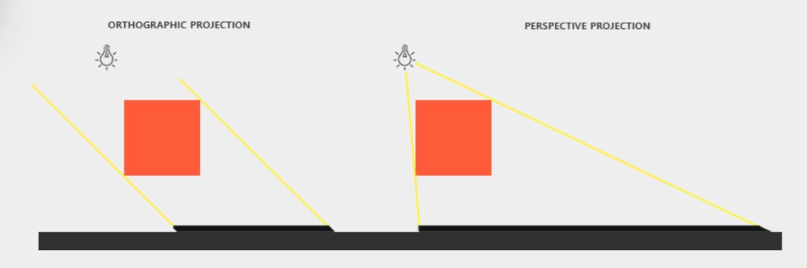

direct light  一般用正交投影，有具体位置的光源(omni、spot)一般用透视投影；透视投影变换过后，z值不再是线性的，需要通过 depth test 那里介绍的转换得到线性的深度值

# Point Shadow

场景中的点光源如何在所有方向产生阴影？考虑与 cubemap 结合

## Generating Depth Cubemap

第一步需要将生成 shadow map 的部分改成 shadow cubemap

```cpp
// generate depth cubemap
glBindTexture(GL_TEXTURE_CUBE_MAP, depthCubemap);
for (unsigned int i = 0; i < 6; ++i)
        glTexImage2D(GL_TEXTURE_CUBE_MAP_POSITIVE_X + i, 0, GL_DEPTH_COMPONENT, 
                     SHADOW_WIDTH, SHADOW_HEIGHT, 0, GL_DEPTH_COMPONENT, GL_FLOAT, NULL);
// attach depthcubemap to fbo
glBindFramebuffer(GL_FRAMEBUFFER, depthMapFBO);
glFramebufferTexture(GL_FRAMEBUFFER, GL_DEPTH_ATTACHMENT, depthCubemap, 0);
glDrawBuffer(GL_NONE);
glReadBuffer(GL_NONE);
glBindFramebuffer(GL_FRAMEBUFFER, 0); 
```

第二步用 depth shader 进行 shadow cubemap 的渲染 ，因为在 light's view 需要向 cubemap 共六个方向生成阴影，所以可以利用 geometry shader 将每个三角形沿六个方向的透视投影变换到对应的 light space，geometry shader 中的内置变量 `gl_Layer` 可以指定`EmitPrimiitive()`对应到 cubemap 中的哪个面；fragment shader 中再将片元到光源的距离存到 `gl_FragDepth`中就得到一个完整的 depth cubemap

将 shadow_cubemap 可视化：

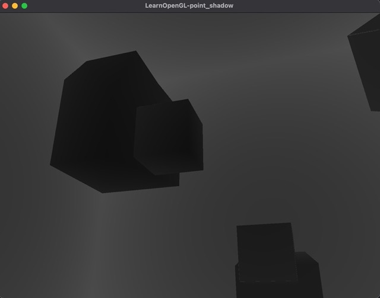

## Render With Depth Cubemap

之后的操作就和普通 shadow map 差不多了，只不过  取 texture 是从cubemap 中取：

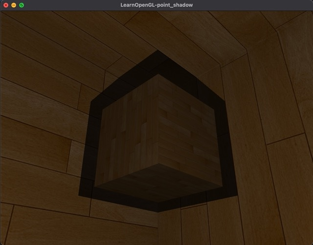

## PCF

从 cubemap 上查深度用的是：

`closest_depth = texture(shadow_cubemap, light_to_frag).r;`

应用 PC，可以对 light_to_frag 周围一个小方盒采样，变成：

```cpp
// n^3 个采样
closest_depth = texture(shadow_cubemap, light_to_frag + vec3(dx, dy, dz)).r;
shadow += current_depth - bias < closest_depth ? 1.0 : 0.0;
//...
shadow /= n * n * n;
```

效果还是不错的，但是帧率有点低：

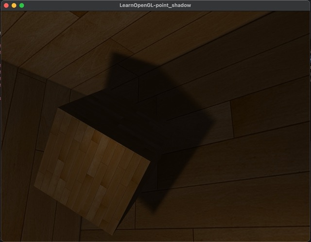

用一些更好的采样策略可以用更少的采样点得到更好更快的结果：


# Normal Mapping

原理不赘述了，原文章写的很好，特别是切线空间的推理那一部分

不采用 normal_map：

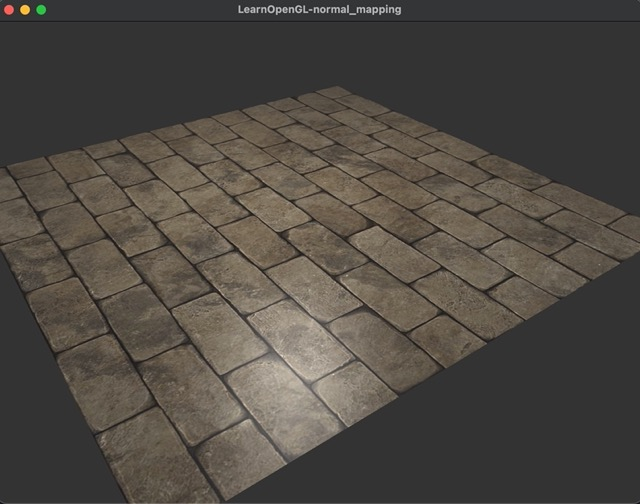

采用 normal_map：

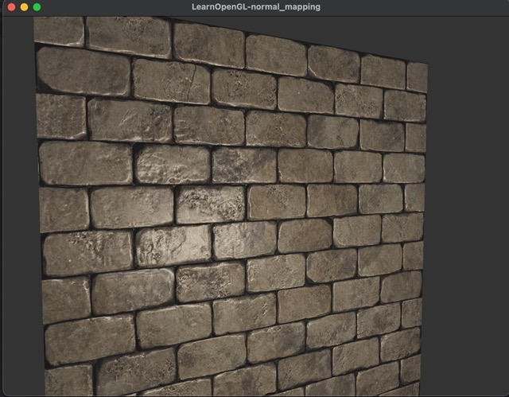

需要注意的是，比较了两种 shading 方式：

一种是在world space 计算光照，需要在 vertex shader 中计算好 TBN 矩阵并将(TBN)^-1^传给 fragment shader，因为 fragment shader 直接从法线贴图中获取的值是切线空间的值，需要乘 (TBN)^-1^变换到 world space 计算光照。

第一种方式在 fragment shader 中有一次矩阵的计算，而 fragment shader 比 vertex shader 更“宝贵”，为了效率考虑将光照计算转移到切线空间，这样就需要将`FragPos`、 `view_pos` 和  `light_pos` 都乘 TBN 传给fragment shader
